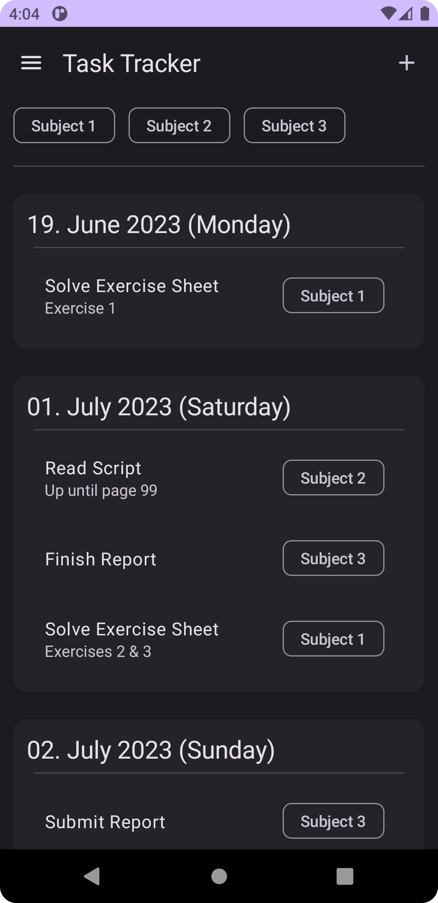

# Task Tracker

A simple app written in Kotlin using Jetpack Compose that enables users to manage their tasks more efficiently. Tasks can be modified, archived and deleted. To stay focused on the assignment at hand, tasks can be filtered such that only the relevant ones are shown.

    
    
    
    

